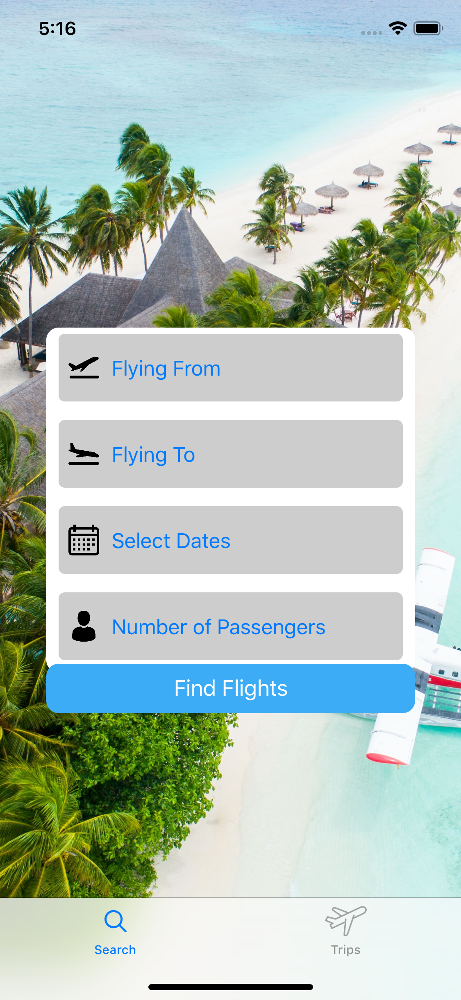
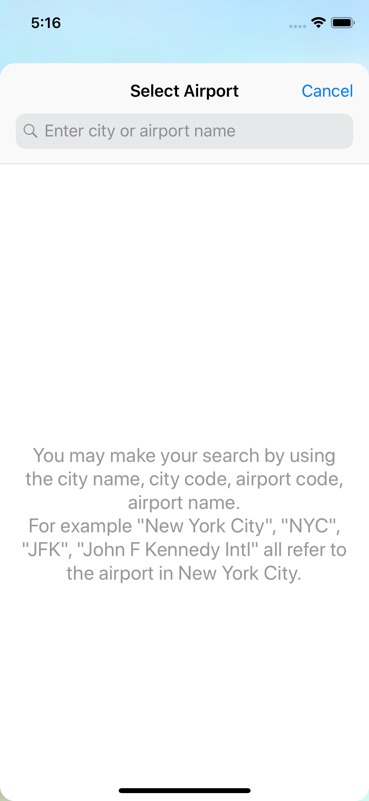
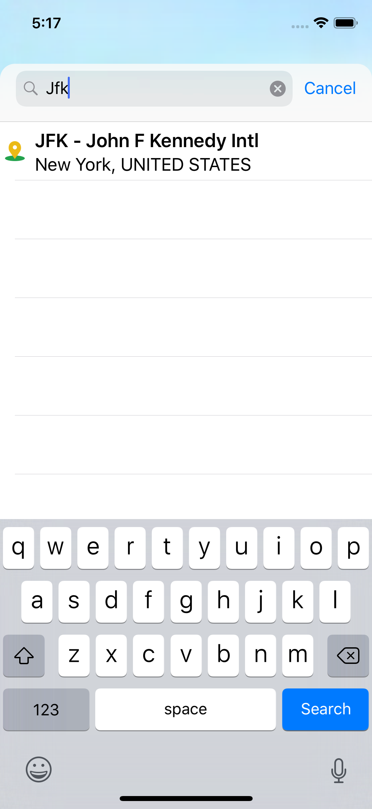
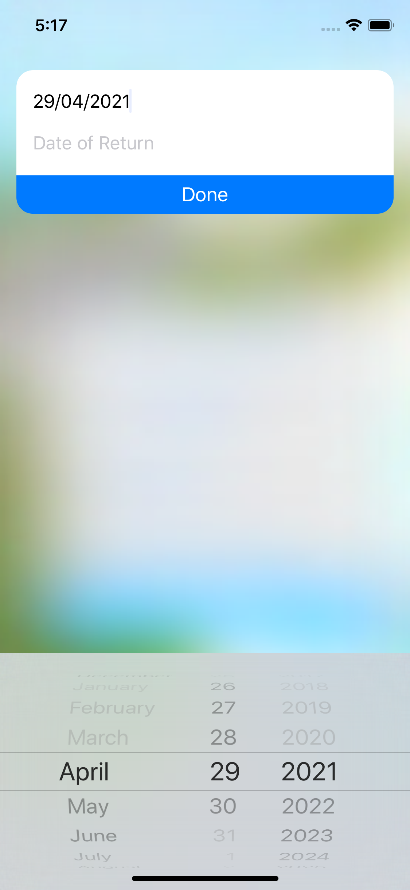

# richsflights
Flight price tracking project

## Motivation
This was a project done for one my mobile development class in college. I am a huge aviation fan and I wanted to take on a project that would be able to show my skills in iOS. The project also served as a way for me to search for flight prices without the fear of the price being jacked up because of trackers used on most flight booking websites.

## Screenshots

  
  
  
  

## Architecture
Application was built using the MVC archirecture.

## Tech and Frameworks
All programming was done in Swift. The user interface was built programmatically using UIKit. Application also makes use of SQLite as the database service for the names of all the airports in the world.
